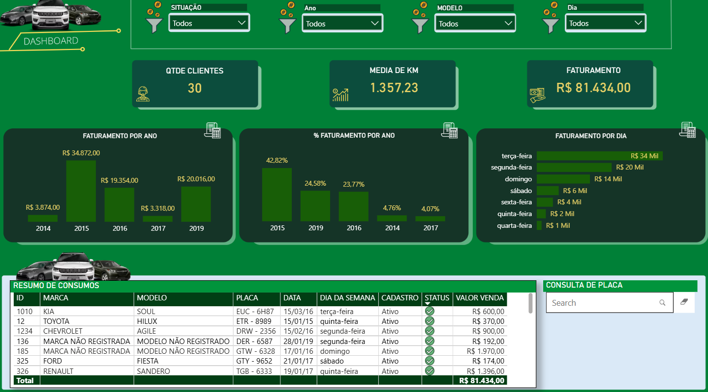
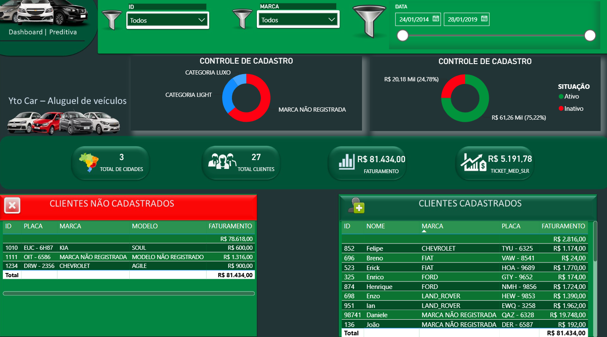
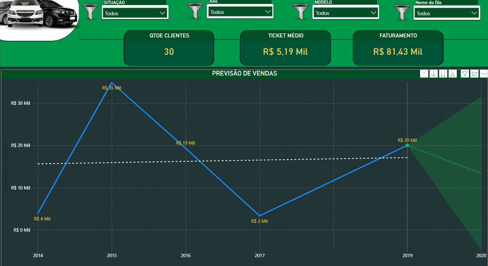

# Dashboard de Locação de Veículos — Power BI

Relatório gerencial para a Yto Car, uma locadora fictícia: quanto entra, de quais clientes, em que dias da semana e o que se espera para os próximos períodos.

**Projeto de estudo com dados fictícios.** Nenhuma informação real de empresa ou de pessoa física.

## O problema

Uma locadora precisa responder, toda semana, a perguntas que costumam estar espalhadas em planilhas: quanto faturamos e como isso se compara aos outros anos, quais clientes estão ativos e quais estão com cadastro irregular, e quanto se roda por locação. O relatório reúne essas respostas em um único arquivo navegável.

## O que os dados mostram

| Achado | Detalhe |
|---|---|
| Receita concentrada em um ano | 2015 respondeu por 42,8% dos R$ 81.434 faturados entre 2014 e 2019. A base não tem registros de 2018. |
| Receita concentrada em um dia | Terça-feira soma R$ 34 mil, cerca de 42% do total. Quarta e quinta juntas somam R$ 3 mil. |
| Um quarto da receita vem de cadastro inativo | R$ 20,18 mil, ou 24,78% do faturamento, é de clientes com situação inativa. |
| Três clientes sem cadastro | Três locações, somando R$ 2.816, não têm cliente correspondente na base de cadastro. |
| Previsão com incerteza alta | Com apenas seis pontos anuais, a projeção para 2020 aponta queda, com intervalo de confiança largo. Deve ser lida como tendência, não como meta. |

## Páginas

| Página | O que responde |
|---|---|
| Capa | Tela de abertura com navegação para o relatório |
| Operação | Faturamento total, por ano e por dia da semana, quantidade de clientes, média de KM e resumo de consumos com consulta por placa |
| Clientes | Situação cadastral, distribuição por categoria, clientes cadastrados e não cadastrados |
| Previsão | Ticket médio, faturamento e projeção de vendas com intervalo de confiança |

### Clientes

### Previsão

### Capa

## Modelo de dados

| Tabela | Papel no modelo |
|---|---|
| tb_km | Fato: locações, com data, placa, marca, modelo, KM e total da venda |
| tb_cli | Dimensão: clientes, com ID, nome e situação cadastral |
| MEDIDAS | Tabela dedicada apenas às medidas DAX, para manter o modelo organizado |
| INNER JOIN e ANT LEFT | Consultas de mesclagem criadas no Power Query |

As duas últimas merecem destaque. Em vez de trazer tudo em uma tabela só, o modelo usa mesclagem de consultas no Power Query: um inner join para cruzar locações com clientes cadastrados e um left anti join para isolar as locações que não têm cliente correspondente. É daí que saem as duas tabelas da página Clientes. Locação sem cliente cadastrado é um problema de qualidade de dados antes de ser um problema de visualização, e é por isso que ele é tratado no ETL.

## Medidas DAX

| Medida | Para que serve |
|---|---|
| FATURAMENTO | Receita total do período filtrado |
| FAT MEDIDA | Faturamento usado nas comparações percentuais entre anos |
| TICKET_MED_SLR | Ticket médio por cliente |
| MEDIA DE KM | Quilometragem média rodada |
| TT_CIDADES | Total de cidades atendidas |

## Recursos usados

Previsão nativa do Power BI no gráfico de linha, com limite superior e inferior de confiança. Visual customizado Text Filter para consulta livre por placa. Navegação por botões entre a capa e as páginas do relatório. Segmentações por situação, ano, modelo, dia da semana, marca e intervalo de datas, e plano de fundo personalizado.

## Como abrir

Baixe o arquivo Locacao_Veiculos.pbix e abra no Power BI Desktop. O modelo já vem com os dados importados, não é preciso configurar nenhuma conexão.

## Stack

Power BI Desktop, Power Query (M), DAX, modelagem de dados.
